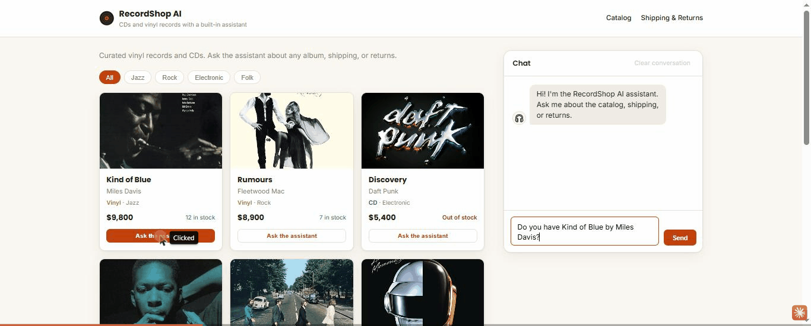

# RecordShop-AI



**🔗 Demo en vivo: [record-shop-ai.vercel.app](https://record-shop-ai.vercel.app/)**
(el backend gratis de Render "duerme" sin uso — el primer mensaje puede tardar
30-50s mientras arranca)

Chatbot de soporte con IA para una tienda ficticia de CDs y vinilos.
Proyecto de portfolio — **FastAPI + React + Gemini API**.

Responde preguntas sobre política de envíos, política de devoluciones y el
catálogo de productos. Sin pagos reales, sin login, sin memoria entre sesiones
(fuera de alcance a propósito).

## Stack

- **Backend:** Python + FastAPI
- **Frontend:** React + Vite
- **LLM:** Google Gemini API (nivel gratuito, modelo Flash)

## Estructura

```
recordshop-ai/
├── .env.example          # plantilla de variables de entorno del backend
├── render.yaml           # blueprint de deploy del backend en Render
├── backend/              # API FastAPI
│   ├── main.py           # app + endpoints (/health, /catalog, /chat)
│   ├── gemini_client.py  # arma el prompt y llama a Gemini
│   ├── catalog.py        # carga data/catalogo.json
│   ├── rate_limit.py     # límite de requests/minuto por IP para /chat
│   ├── requirements.txt
│   ├── tests/            # pytest, no gasta cuota de Gemini (todo mockeado)
│   ├── prompts/
│   │   └── system_prompt.py
│   └── data/
│       └── catalogo.json # catálogo ficticio (datos de ejemplo)
└── frontend/             # tienda + chat (React + Vite)
    ├── index.html
    ├── package.json
    └── src/
        ├── App.jsx        # layout: header, catálogo, chat, footer
        ├── Header.jsx      # menú
        ├── Footer.jsx      # políticas + disclaimer
        ├── ProductGrid.jsx # grilla de productos (consume /catalog)
        └── Chat.jsx        # interfaz de chat (consume /chat)
```

## Cómo correrlo localmente

Hacen falta **dos terminales**: una para el backend y otra para el frontend.

### 1. Backend

```bash
cd backend
py -m venv .venv
.venv\Scripts\Activate.ps1    # Windows (PowerShell)
# source .venv/bin/activate   # macOS / Linux
pip install -r requirements.txt
Copy-Item ..\.env.example .env   # completar GEMINI_API_KEY (gratis en https://aistudio.google.com/apikey)
uvicorn main:app --reload --port 8001
```

API en http://localhost:8001 · docs en http://localhost:8001/docs

> Puerto **8001**: en Windows el 8000 suele estar reservado por Hyper-V/WSL y
> `uvicorn` falla con `WinError 10013`. Si en tu máquina el 8000 anda, usalo y
> ajustá `VITE_API_URL` en `frontend/.env`.
>
> Si PowerShell bloquea `Activate.ps1`, corré una vez:
> `Set-ExecutionPolicy -Scope CurrentUser RemoteSigned`

Probar el health-check:

```bash
curl http://localhost:8001/health
# {"status":"ok"}
```

Probar el chat (requiere `GEMINI_API_KEY` configurada):

```bash
curl -X POST http://localhost:8001/chat -H "Content-Type: application/json" -d "{\"message\":\"tienen Kind of Blue?\"}"
```

### 2. Frontend

```bash
cd frontend
npm install
cp .env.example .env          # PowerShell: Copy-Item .env.example .env
npm run dev
```

App en http://localhost:5173. Muestra un indicador de si el backend responde.

### Atajo: levantar todo con un script

Una vez instaladas las dependencias de ambos lados (pasos 1 y 2 de arriba, aunque
sea una vez), se puede levantar todo con un solo comando desde la raíz:

```powershell
.\scripts\start-dev.ps1
```

Abre backend y frontend cada uno en su propia ventana de PowerShell. Para
frenar los dos de una:

```powershell
.\scripts\stop-dev.ps1
```

`stop-dev.ps1` no se limita a mirar qué proceso "dice" Windows que tiene
ocupado el puerto (`uvicorn --reload` deja procesos hijos que Windows a veces
reporta mal): mata el árbol completo de procesos de cada ventana, así no
quedan servidores huérfanos corriendo en segundo plano.

## Deploy

**Ya deployado:**
- Frontend: https://record-shop-ai.vercel.app/
- Backend: https://recordshop-ai-backend.onrender.com

Guía para reproducirlo (por ejemplo, en otra cuenta):

**Backend → Render, frontend → Vercel.** El orden importa: el backend necesita
un dominio antes de poder buildear el frontend con la URL correcta, y el
backend necesita saber la URL del frontend para CORS — por eso se hace en
este orden y se vuelve una vez al backend al final.

### 1. Backend en Render

1. Entrá a [render.com](https://render.com), creá una cuenta (podés con GitHub).
2. **New > Blueprint**, elegí este repo. Render lee `render.yaml` de la raíz
   y arma el servicio solo (build/start command, todo ya configurado).
3. Te va a pedir `GEMINI_API_KEY` — pegala vos ahí (nunca va al repo).
4. Deploy. Cuando termine, copiá la URL que te da
   (algo como `https://recordshop-ai-backend.onrender.com`).
5. Probala: `https://<tu-url>.onrender.com/health` tiene que devolver `{"status":"ok"}`.

> El plan free de Render "duerme" el servicio tras un rato sin tráfico — el
> primer request después de eso tarda ~30-50s en responder mientras arranca.
> Es normal, no es un error.

### 2. Frontend en Vercel

1. Entrá a [vercel.com](https://vercel.com), creá una cuenta (podés con GitHub).
2. **Add New > Project**, elegí este repo.
3. En la configuración del proyecto: **Root Directory** → `frontend`
   (Vercel detecta Vite solo, no hace falta tocar el build command).
4. En **Environment Variables**, agregá `VITE_API_URL` = la URL de Render del
   paso anterior (ej. `https://recordshop-ai-backend.onrender.com`).
5. Deploy. Copiá la URL que te da (ej. `https://recordshop-ai.vercel.app`).

### 3. Volver a Render: habilitar CORS para esa URL

1. En el servicio de Render, **Environment**, agregá `ALLOWED_ORIGIN` = la URL
   de Vercel del paso anterior (sin `/` al final).
2. Guardá — Render redeploya solo.
3. Abrí la URL de Vercel: el catálogo tiene que cargar y el chat tiene que
   funcionar. Si el chat no conecta, revisá que `ALLOWED_ORIGIN` sea
   exactamente la URL de Vercel (con `https://`, sin barra al final).

## Estado actual

Funcional de punta a punta: backend con `/health`, `/catalog` y `/chat`
(Gemini integrado, con reintentos, rate limit propio y tests con `pytest`
en `backend/tests/`), y frontend tipo tienda — header con menú, grilla de
productos (consume `/catalog`), chat fijo a la derecha (consume `/chat`,
también se puede precargar una pregunta desde una tarjeta de producto) y
footer con políticas. **Deployado y probado de punta a punta en producción**
(ver sección Deploy) — CORS, rate limit y el chat respondiendo con datos
reales del catálogo, todo verificado en vivo.

## Decisiones técnicas

- **Vite en lugar de Create React App** — CRA está discontinuado; Vite es el
  scaffold recomendado hoy para SPAs de React (arranque y HMR más rápidos).
- **CORS: localhost siempre permitido (regex), producción por variable de
  entorno** (`backend/main.py`) — en dev acepta cualquier puerto de
  `localhost`/`127.0.0.1` porque Vite salta de puerto si el anterior está
  ocupado; en producción se suma el dominio real vía `ALLOWED_ORIGIN`, que no
  se hardcodea porque no se conoce hasta que el frontend está deployado (ver
  sección Deploy).
- **La API key de Gemini vive en `backend/.env`** — nunca hardcodeada ni
  commiteada; `.env.example` queda como plantilla.
- **SDK `google-genai` (no el viejo `google-generativeai`)** — es el paquete
  que Google mantiene activamente hoy para la API de Gemini.
- **Modelo fijado por alias (`gemini-flash-latest`), no por versión** — evita
  tener que tocar código cada vez que Google saca una versión nueva de Flash.
- **`/chat` no guarda historial** — cada mensaje es independiente; coherente
  con "sin memoria entre sesiones" (fuera de alcance del proyecto).
- **La interfaz (lo que ve el visitante) está en inglés**, pensada para
  portfolio ante reclutadores internacionales. La documentación (este
  README, `CLAUDE.md`, comentarios del código) queda en español. El
  `system_prompt.py` responde en el idioma en que escriba el cliente, así
  que el chat funciona igual si alguien le escribe en español.

### Políticas de la tienda (ficticias, para este proyecto)

**Envíos:**
- Estándar: 5-7 días hábiles, $1,500
- Express: 2-3 días hábiles, $3,500
- Gratis en compras +$15,000
- Cobertura: todo el país

**Devoluciones:**
- 30 días desde la recepción
- Producto sin usar, en empaque original
- Vinilos: sello de calidad no debe estar roto
- Reembolso en 5-10 días hábiles
- Productos en oferta/liquidación: sin devolución, solo cambio

### Por qué el catálogo se pasa completo en cada consulta

Con 8 productos es simple pasarle todo el catálogo al modelo en cada llamada. No escala a catálogos grandes — esa limitación se resuelve en el Proyecto 2 con RAG (retrieval en vez de mandar todo siempre).